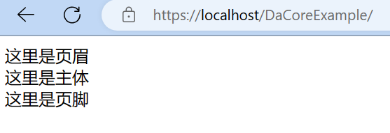
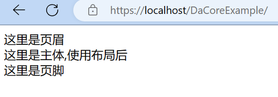

# 首页

新建首頁模板 `static/view/index.twig`

:::tip
关于[模板引擎(Twig)](../reference/template-twig.md)
:::

```html
<html lang="zh-CN">
    <head>
        <meta charset="utf-8">
        <meta name="viewport" content="width=device-width,initial-scale=1">
        <title>Home Page</title>
    </head>
    <body>
        <header>这里是页眉</header>
        <main>这里是主体</main>
        <footer>这里是页脚</footer>
    </body>
</html>
```

查看 https://localhost/DaCoreExample/



::: tip
流程简述: 
1. 所有动态网址都会从单一入口(index.php)开始
2. 通过[路由](../reference/routing.md)表匹配到[控制器](../reference/controller.md)`App/Modules/Home/Controller/IndexController.php`的 `indexAction()` 方法.
3. 控制器读取[模型](../reference/model.md)数据并渲染[视图模板](../reference/view.md) `static/view/index.twig` 后的 HTML交给 [Response](../reference/response.md) 并输出. 
4. DaCore和其它框架有点不同,即控制器内赋值(assign)主要使用 [实体](../reference/entity.md) 
:::
通常一个网站除主体部分，其它是可以共用的。所以可以把main外的其它部分提出来.

新建 layout.twig,复制 index.twig 内容并把`<main></main>`改成twig的block

`static/view/layout.twig`

```twig
<html lang="zh-CN">
    <head>
        <meta charset="utf-8">
        <meta name="viewport" content="width=device-width,initial-scale=1">
        <title>Home Page</title>
    </head>
    <body>
        <header>这里是页眉</header>
        这里是主体部分
        <footer>这里是页脚</footer>
    </body>
</html>
```
修改 index.twig 继承 layout.twig

`static/view/index.twig`
```twig


    <main>
        这里是主体,使用布局后
    </main>

```
再次查看 https://localhost/DaCoreExample/


