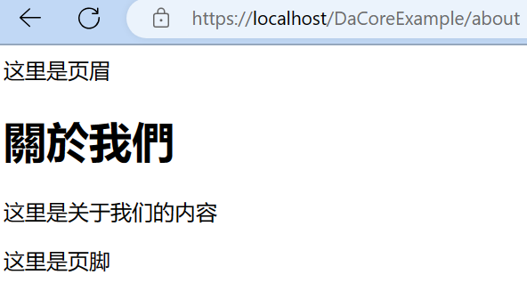

# 公司介绍模块

::: tip
关于[模块](../reference/module.md)
:::

公司介绍模块为已有模块，模块位置在 `App/Modules/About`

公司介绍配置文件 `App/Modules/About/Config/about.yaml`

- `about.enable=1` 启用公司介绍模块，
- `about.embed_components.BannerComponent.enable=0` 关闭横幅。

::: tip
为了方便写文档，配置`about.enable=1`，`about.embed_components.BannerComponent.enable=0`

代表以下两个位置. 这也是读取[配置](../reference/configuration.md)时使用的语法.
```yaml
about:
   enable: 1
   embed_components:
      BannerComponent:
         enable: 0
```
:::

后台>公司介绍>修改内容(编辑器内容),为 `这里是关于我们的内容`>储存

新建 `static/view/about.twig` 

```twig


   <main>
        <h1>{{ page.name }}</h1>
        <div>
            {{ page.content|raw }}
        </div>
    </main>

```

查看网址 `https://localhost/DaCoreExample/about`




