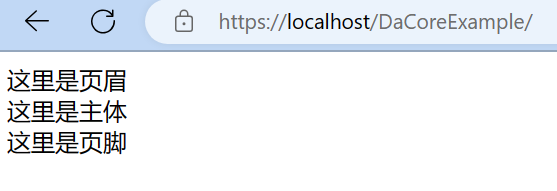

# 实例 2-首页

新建首頁模板 `static/view/index.twig`

:::tip
关于 Twig 模板引擎[点这里](./template-twig.md)查看
:::

```html
<html lang="zh-TW">
    <head>
        <meta charset="utf-8">
        <meta name="viewport" content="width=device-width,initial-scale=1">
        <title>Home Page</title>
    </head>
    <body>
        <header>
            这里是页眉
        </header>
        <main>
            这里是主体
        </main>
        <footer>这里是页脚</footer>
    </body>
</html>
```

查看 https://localhost/DaCoreExample/



